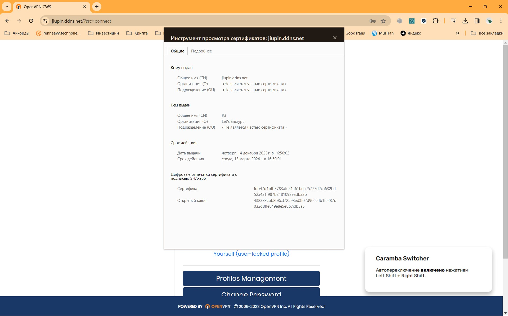

# ДЗ Семинар 8:
1 Доделать свой сертификат (скиньте его скриншот). 

2 Настроить сеть согласно информации на схеме (https://disk.yandex.ru/d/Vaxkf2X0RG9NGw):  
2.1 Сымитировать "Интернет" с помощью OSPF. Приватных сетей в маршрутизации быть не должно.  
2.2 Для компьютеров из Office 1 предоставить доступ в "Интернет" с помощью PAT.  
2.3 Открыть доступ из "Интернета" к серверам из Office 2 c помощью Port Forwarding.  
2.4 Для компьютеров из Office 1 должны открываться разные сайты по HTTP и HTTPS из Office 2 по одному доменному имени.  
2.5 Предоставить скриншоты открытых разных сайтов по одному доменному имени.  
2.6 Предоставить скриншот таблицы NAT трансляций с Router3.  
2.7 Предоставить скриншот таблицы маршрутизации с Router0.

### Решения:
1 Доделать свой сертификат: 
      
2 Настроить сеть: 
2.1 Предоставить скриншоты открытых разных сайтов по одному доменному имени.  
      
2.1 Предоставить скриншот таблицы NAT трансляций с Router3.  
      
2.2 Предоставить скриншот таблицы маршрутизации с Router0.  
      
